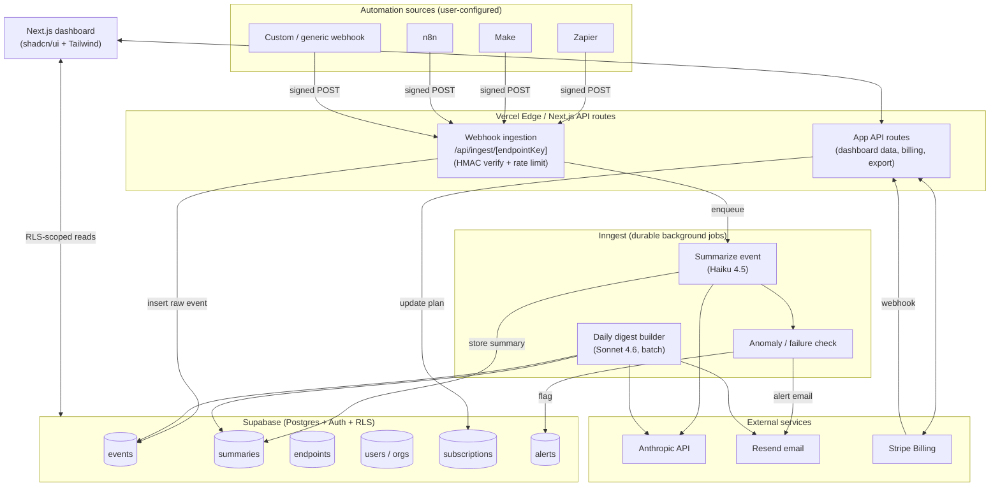
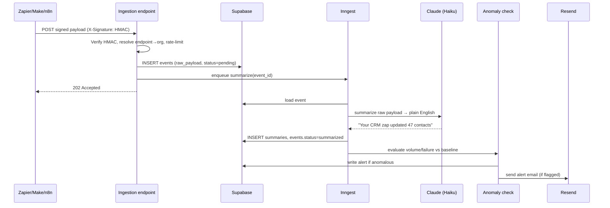

# AI Agent Audit Trail for SMBs — End-to-End Analysis

*A critical review, system architecture, development roadmap, and implementation guide for the "plain-English logs of every AI action" SaaS concept.*

---

## Part 1 — Critical Review

### 1.1 What the product actually is (vs. how it's pitched)

The pitch sells **"plain-English logs of every action any AI tool took on your business."** The buildable reality is narrower and worth naming precisely up front, because the gap between the two is where this product either succeeds or quietly dies:

> **You can only audit what flows through an automation layer that you can instrument.** In practice that means Zapier, Make, n8n, and a handful of platforms that emit webhooks you can capture. You cannot capture "every AI tool" — not Salesforce Einstein, not HubSpot's native AI, not a custom GPT a sales rep uses in a browser tab, not Claude inside someone's IDE.

So the honest product is: **"A plain-English activity log and compliance export for your no-code automations (Zapier / Make / n8n)."** That is still a real product. But the moment your landing page promises "every AI tool" and a buyer wires up one Zapier zap and sees that 90% of their AI usage is invisible, you have a trust problem — ironic for a trust product. **Scope the promise to what you can actually deliver.**

### 1.2 The two hard technical problems the pitch hand-waves

**Problem A — Capture coverage.** Webhooks only fire when the user configures an automation to POST to your endpoint. Many valuable actions never naturally emit a webhook. You are dependent on the user instrumenting their own zaps, which is friction *and* leaves silent gaps. Mitigation exists (a Zapier app / Make module that auto-forwards every step), but building and getting that listed is real work the 6-week plan ignores.

**Problem B — The diff is the product, and the diff is hard.** "Your Zapier bot updated 47 CRM contacts" implies you know the *before* and *after* state. A webhook from Zapier tells you a step *ran*; it rarely contains the prior value of the field that changed. To show a true diff you either need the automation to include before/after data (usually unavailable) or you independently poll the target system's API — which means OAuth into the user's CRM, rate limits, and per-integration engineering. The pitch lists "diff viewer" as a casual feature; it is arguably the hardest thing in the entire build. **For the MVP, reframe it as an "action log" (what the automation reported it did), not a "state diff" (what actually changed in the system of record).**

### 1.3 Market & compliance reality check

The pitch leans heavily on **"EU AI Act enforcement started August 2026 — compliance demand is arriving."** I verified the current state of the law, and the framing is misleading for the stated audience:

- The EU AI Act's high-risk obligations are dated to apply from **2 August 2026** — so the date is roughly right.
- **But on 7 May 2026, EU lawmakers reached political agreement (the "Digital Omnibus") to push key high-risk deadlines later**, linking them to the availability of harmonised standards, with long-stop dates around **December 2027** for Annex III high-risk systems. The "looming August 2026 cliff" the pitch sells has materially softened.
- More importantly: the logging / record-keeping obligations apply to **providers and deployers of *high-risk* AI systems** (Annex III). **A typical US SMB running a Zapier zap is almost certainly not a high-risk AI system deployer.** The Act explicitly offers SMEs *simplified* compliance pathways. So among "33M US SMBs," the slice with a genuine EU-AI-Act logging obligation is tiny.

**Conclusion:** Compliance is a *positioning* angle, not a *demand* engine, for this audience. Treat it as a feature ("export a clean audit log if you ever need one") not as the core wedge. If you want a real compliance buyer, your ICP is not "any SMB" — it's regulated-adjacent small businesses (healthcare-adjacent, fintech-adjacent, EU-facing) who already feel audit pressure. That's a much smaller TAM than 33M, but a real one.

### 1.4 Competition reality check

The "Competition: 1.5 / open" score conflates two different markets:

- **The adjacent market is crowded and well-funded.** AI agent observability is hot: Langfuse, LangSmith, Arize/Phoenix, AgentOps, Confident AI, and Braintrust (which raised an ~$80M Series B in early 2026 and counts Zapier, Notion, and Coursera as users). There's even an open-source "AgentLens" doing MCP-native, tamper-evident audit logging. So "competition is open" is *false* at the category level.
- **The specific niche genuinely is underserved.** Every one of those tools is **developer-facing**: SDK instrumentation, OpenTelemetry traces, eval pipelines. None targets a non-technical SMB owner who just wants to read "what did my bot do today" in plain English. So the pitch's core claim — *existing tools require engineering teams* — is **correct**, and that is the real gap.

**Two competitive threats the pitch ignores:**
1. **"Good enough free."** Zapier has Zap run history; Make has execution history; n8n has execution logs. They're ugly and per-platform, but they're free and built in. Your plain-English, cross-platform, alerting layer must be *clearly* better than free.
2. **Downmarket motion.** The funded observability players can ship a "simple mode" at any time. Your moat has to be distribution + SMB-specific UX, not technology.

### 1.5 The willingness-to-pay problem (vitamin vs. painkiller)

Without a hard compliance mandate, "read summaries of what your automations did" is a **vitamin**, not a painkiller. SMBs are price-sensitive and churn-heavy. The version that becomes a painkiller is **alerting on failures and anomalies**: *"Your invoicing zap silently stopped running 3 days ago"* or *"Your bot just emailed 400 contacts — that's 8× normal."* That prevents revenue loss and embarrassment, which people pay to avoid. **Lead with "catch your automations when they break or go rogue," not "here's a diary."** This reframing should drive both the marketing and the build order (anomaly/failure detection moves up, not to week 5).

### 1.6 Design-decision critiques

| Decision | Issue | Recommendation |
|---|---|---|
| `POST /api/webhook/:userId` open ingestion | **Security hole.** Anyone who guesses/sees a `userId` can inject fake audit events into a *trust* product. | Per-endpoint opaque token + HMAC signature verification. Never put the tenant key in a guessable path alone. |
| LLM call per event | At high event volume this is slow and costs add up; also wasteful (most events are routine). | Summarize cheaply (Haiku) or templated; reserve LLM synthesis for the **digest** and for **flagged** events. Batch + cache. |
| Storing raw payloads of CRM/email data | You're now a **high-value data target** holding customers' business PII — for a *compliance* product, this is a serious liability the pitch never mentions. | Encryption at rest, explicit retention windows, field-level redaction options, a DPA, and a credible security story *before* you sell to anyone compliance-minded. |
| z-score on event volume for anomaly detection | For low-volume, bursty SMB traffic, z-score on small N produces constant false positives → alert fatigue → churn. | Use robust methods (MAD / rolling percentiles), require a minimum baseline window, and start with simpler high-signal rules (failure spikes, volume vs. same-weekday baseline). |
| "First paying customer in week 6" | Conflates *building* with *selling*. Distribution gets one week and a 20-person DM plan. | Treat distribution as a parallel track from week 1 (build in public, collect a waitlist), and decouple "feature-complete" from "first revenue." |

### 1.7 Stack verdict (short version — details in Part 2)

The stack is **largely sound** and well-chosen for low-hallucination codegen. Next.js + Supabase + Stripe + Resend + Vercel is a proven, over-documented combo. Two notes:
- The model string `claude-sonnet-4-6` is valid, but **use Haiku 4.5 ($1/$5 per MTok) for per-event summaries** and Sonnet 4.6 ($3/$15) only for the richer digest synthesis — see the cost model in Part 4.
- Inngest is a legitimately good pick for durable jobs/retries, though Supabase `pg_cron` + Vercel Cron could cover the MVP for free if you want one fewer vendor.

### 1.8 Overall verdict

**Concept: viable but mis-scoped and mis-positioned as pitched.** The real opportunity is *"failure & anomaly alerting + plain-English activity log + optional compliance export for no-code automations,"* sold to SMBs who'd lose money or face embarrassment when automations break — not "audit every AI tool for EU AI Act compliance." Re-scoped that way, buildability is genuinely high, the gap is real, and a solo dev can ship it. The scores I'd revise: **Market 6/10** (real but smaller than 33M), **Buildability 7/10** (the diff/capture problems are underestimated), **Competition 4/10** (adjacent space is hot; your niche is open). Still worth building — just with eyes open.

---

## Part 2 — System Architecture

### 2.1 High-level component architecture



### 2.2 End-to-end data flow (single event)



### 2.3 Component responsibilities

- **Ingestion endpoint** — Stateless, fast, idempotent. Verifies signature, resolves the endpoint key to an org, enforces per-plan rate limits and quotas, persists the raw event, enqueues async work, returns `202` immediately. Never calls the LLM inline (keep p95 latency low so source platforms don't time out).
- **Summarizer worker (Inngest)** — Pulls raw payload, normalizes it, calls Haiku 4.5 with a tight system prompt + (cached) instructions, stores a plain-English summary plus extracted structured fields (action type, object type, count, target system).
- **Anomaly/failure worker** — Compares the event/volume against the org's rolling baseline; raises alerts on failure spikes and abnormal volume. Runs both per-event (cheap rules) and on a schedule (statistical check).
- **Digest builder (scheduled Inngest job)** — Once daily per org, aggregates the day's summaries, asks Sonnet 4.6 to synthesize a narrative digest, sends via Resend. Uses the Batch API where possible.
- **Dashboard (Next.js + shadcn/ui)** — Event timeline, per-event detail, search/filter, alerts inbox, settings (endpoints, integrations), billing, export.
- **Billing (Stripe)** — Checkout + customer portal; webhook keeps `subscriptions` in sync; quota enforcement reads plan from DB.

### 2.4 Tech-stack assessment

| Layer | Pitch choice | Verdict | Notes |
|---|---|---|---|
| Framework | Next.js 14 App Router | ✅ Keep | Consider 15 if starting fresh; App Router patterns are stable. |
| Language | TypeScript | ✅ Keep | Non-negotiable for codegen quality. |
| DB / Auth | Supabase (Postgres + Auth + RLS) | ✅ Keep | RLS is your multi-tenant security backbone — design it first. |
| Payments | Stripe Billing | ✅ Keep | Use Checkout + Billing Portal; minimize custom UI. |
| Background jobs | Inngest | ✅ Keep (or pg_cron+Vercel Cron for free MVP) | Durable retries are exactly what flaky webhook→LLM pipelines need. |
| Summarizer | Anthropic SDK | ✅ Keep, change model | **Haiku 4.5** per event, **Sonnet 4.6** for digests. Add prompt caching + batch. |
| Email | Resend | ✅ Keep | Fine for digests/alerts. |
| Deploy | Vercel | ✅ Keep | Watch function timeouts — that's *why* the LLM call is async. |
| UI | shadcn/ui + Tailwind | ✅ Keep | |
| Landing | Lovable or Next.js | ✅ Keep separate | |
| **Missing: secrets/signing** | — | ⚠️ Add | HMAC signing lib + per-endpoint secrets. |
| **Missing: data retention/encryption** | — | ⚠️ Add | Retention policy + encryption story; you hold customer PII. |
| **Missing: error tracking** | — | ⚠️ Add | Sentry (free tier) — for a reliability product, your own reliability matters. |

### 2.5 Security architecture (the part the pitch skipped)

1. **Ingestion auth:** each endpoint gets a random `endpoint_key` (in the URL) **and** a shared `signing_secret`. Source platforms send `X-Signature: sha256=HMAC(secret, body)`. Reject anything that doesn't verify. This stops event injection — critical for a trust product.
2. **Tenant isolation:** Postgres **Row-Level Security** on every table keyed by `org_id`. The dashboard uses the user's Supabase JWT; server-side jobs use the service role and set `org_id` explicitly.
3. **Data minimization & retention:** offer field redaction on ingest, and auto-purge raw payloads after the plan's retention window (e.g., 30/90/365 days). Keep derived summaries longer than raw payloads if helpful.
4. **Encryption & secrets:** rely on Supabase encryption at rest; keep API keys in Vercel env vars; never log raw payloads to your error tracker.
5. **Quotas:** enforce per-plan monthly event caps at the ingestion edge to cap both abuse and your LLM bill.

---

## Part 3 — Phased Development Roadmap

The original 6-week plan is a good skeleton. Below is a **re-sequenced** version that moves the painkiller (alerting) earlier, adds the security work the original omitted, and is honest about complexity. "Complexity" is relative effort for a solo dev comfortable with the stack.

| Phase | Goal / milestone | Key deliverables | Depends on | Complexity | Risk notes |
|---|---|---|---|---|---|
| **0 (pre-week)** | Foundations | Repo, Supabase project, schema + RLS, env/secret setup, Sentry, CI to Vercel | — | Low | Get RLS right *now*; retrofitting tenancy is painful. |
| **1** | Auth + empty dashboard | Supabase magic-link auth, org creation, protected dashboard shell, settings page | 0 | Low | "I can log in" milestone. |
| **2** | Secure ingestion | `endpoints` table, key+secret generation, **HMAC-verified** `/api/ingest/[key]`, raw event storage, event list view, quota check | 1 | **Medium** | Signature verification + idempotency are the gotchas. Test with real Zapier/Make/n8n. |
| **3** | Summarization (core feature) | Inngest worker, Haiku summarizer, structured field extraction, summaries in UI, retry logic | 2 | Medium | Prompt design + payload normalization across platforms is the hidden time sink. Cache the system prompt. |
| **4** | Alerting (the painkiller) | Failure detection, volume baseline + robust anomaly rule, alerts table, alert emails (Resend) | 3 | **Medium-High** | Tuning to avoid false-positive fatigue is the real work — start with high-signal rules. |
| **5** | Monetization | Stripe Checkout + Billing Portal, plan→quota mapping, Stripe webhook → `subscriptions`, gating | 1, 2 | Medium | Use Stripe-hosted UI; test webhook with Stripe CLI. "Can charge money" milestone. |
| **6** | Digest + compliance export | Daily digest job (Sonnet 4.6, batch), digest email, PDF export (pdf-lib / your pdf tooling), retention purge job | 3, 4 | Medium | PDF layout eats time; keep v1 plain. |
| **7** | Polish + integrations on-ramp | Onboarding flow, "connect Zapier/Make/n8n" step-by-step guides, search/filter, empty states | all | Low-Med | Onboarding friction = activation. This is where many SaaS lose users. |
| **8 (parallel from day 1)** | Distribution | Landing page, waitlist, build-in-public posts, Zapier/Make app submission (long lead time), launch posts | — | Med | Don't compress this into one week. Start the Zapier app review early — approval is slow. |

**Realistic timeline:** 6 weeks to *feature-complete MVP* for a focused solo dev is plausible. **6 weeks to first paying customer is optimistic** unless distribution runs in parallel from day one. Budget 8–10 weeks to first revenue and treat anything faster as upside.

**Critical path:** `RLS schema (0)` → `secure ingestion (2)` → `summarizer (3)` → everything else. If ingestion auth or summarization slips, all downstream value slips.

---

## Part 4 — Implementation Guide

### 4.1 Setup & prerequisites

```bash
# Scaffold
npx create-next-app@latest audit-trail --typescript --tailwind --app
cd audit-trail
npx shadcn@latest init

# Core deps
npm i @supabase/supabase-js @supabase/ssr
npm i @anthropic-ai/sdk
npm i stripe
npm i resend
npm i inngest
npm i pdf-lib            # compliance export
npm i @sentry/nextjs     # error tracking

# Dev: local webhook tunnel
# ngrok http 3000   (or the Vercel preview URL once deployed)
```

Environment variables (`.env.local` → mirror in Vercel):

```
NEXT_PUBLIC_SUPABASE_URL=
NEXT_PUBLIC_SUPABASE_ANON_KEY=
SUPABASE_SERVICE_ROLE_KEY=     # server-only, never client
ANTHROPIC_API_KEY=
STRIPE_SECRET_KEY=
STRIPE_WEBHOOK_SECRET=
RESEND_API_KEY=
INNGEST_EVENT_KEY=
INNGEST_SIGNING_KEY=
```

### 4.2 Database schema (Postgres / Supabase, with RLS)

```sql
-- Orgs are the tenant boundary. A user belongs to one org for MVP.
create table orgs (
  id uuid primary key default gen_random_uuid(),
  name text not null,
  plan text not null default 'free',          -- free | starter | pro
  monthly_event_quota int not null default 500,
  retention_days int not null default 30,
  created_at timestamptz default now()
);

create table org_members (
  org_id uuid references orgs(id) on delete cascade,
  user_id uuid references auth.users(id) on delete cascade,
  role text not null default 'owner',
  primary key (org_id, user_id)
);

-- One ingestion endpoint per source the user wires up.
create table endpoints (
  id uuid primary key default gen_random_uuid(),
  org_id uuid not null references orgs(id) on delete cascade,
  label text not null,                          -- "Zapier - CRM sync"
  endpoint_key text not null unique,            -- random, goes in URL
  signing_secret text not null,                 -- random, for HMAC
  source text,                                  -- zapier | make | n8n | custom
  is_active boolean default true,
  created_at timestamptz default now()
);

create table events (
  id uuid primary key default gen_random_uuid(),
  org_id uuid not null references orgs(id) on delete cascade,
  endpoint_id uuid not null references endpoints(id) on delete cascade,
  raw_payload jsonb not null,
  dedup_key text,                               -- for idempotency
  status text not null default 'pending',       -- pending|summarized|failed
  -- extracted structured fields (filled by summarizer)
  action_type text,                             -- created|updated|deleted|sent|...
  object_type text,                             -- contact|email|invoice|...
  object_count int,
  target_system text,                           -- hubspot|gmail|...
  occurred_at timestamptz default now(),
  created_at timestamptz default now()
);
create index on events (org_id, occurred_at desc);
create unique index on events (org_id, dedup_key) where dedup_key is not null;

create table summaries (
  event_id uuid primary key references events(id) on delete cascade,
  org_id uuid not null references orgs(id) on delete cascade,
  text text not null,                           -- "Your CRM zap updated 47 contacts"
  model text,
  created_at timestamptz default now()
);

create table alerts (
  id uuid primary key default gen_random_uuid(),
  org_id uuid not null references orgs(id) on delete cascade,
  kind text not null,                           -- failure_spike|volume_anomaly|stalled
  message text not null,
  severity text not null default 'warning',
  resolved boolean default false,
  created_at timestamptz default now()
);

create table subscriptions (
  org_id uuid primary key references orgs(id) on delete cascade,
  stripe_customer_id text,
  stripe_subscription_id text,
  plan text not null default 'free',
  status text,                                  -- active|past_due|canceled
  current_period_end timestamptz,
  updated_at timestamptz default now()
);

-- ---- Row-Level Security ----
alter table orgs enable row level security;
alter table endpoints enable row level security;
alter table events enable row level security;
alter table summaries enable row level security;
alter table alerts enable row level security;
alter table subscriptions enable row level security;

-- Helper: is the current user a member of this org?
create policy "members read org" on orgs for select
  using (id in (select org_id from org_members where user_id = auth.uid()));

create policy "members read endpoints" on endpoints for all
  using (org_id in (select org_id from org_members where user_id = auth.uid()))
  with check (org_id in (select org_id from org_members where user_id = auth.uid()));

-- Repeat the same membership-based policy for events, summaries, alerts, subscriptions.
-- Server-side jobs use the SERVICE ROLE key (bypasses RLS) and must set org_id explicitly.
```

### 4.3 Secure ingestion endpoint

`app/api/ingest/[key]/route.ts`:

```typescript
import { createClient } from "@supabase/supabase-js";
import crypto from "node:crypto";
import { inngest } from "@/lib/inngest";

const admin = createClient(
  process.env.NEXT_PUBLIC_SUPABASE_URL!,
  process.env.SUPABASE_SERVICE_ROLE_KEY!
);

function verify(secret: string, body: string, header: string | null) {
  if (!header) return false;
  const expected =
    "sha256=" + crypto.createHmac("sha256", secret).update(body).digest("hex");
  // constant-time compare
  const a = Buffer.from(expected);
  const b = Buffer.from(header);
  return a.length === b.length && crypto.timingSafeEqual(a, b);
}

export async function POST(
  req: Request,
  { params }: { params: { key: string } }
) {
  const raw = await req.text(); // verify against exact bytes
  const { data: endpoint } = await admin
    .from("endpoints")
    .select("id, org_id, signing_secret, is_active")
    .eq("endpoint_key", params.key)
    .single();

  if (!endpoint || !endpoint.is_active) return new Response("Not found", { status: 404 });
  if (!verify(endpoint.signing_secret, raw, req.headers.get("x-signature")))
    return new Response("Bad signature", { status: 401 });

  // quota check (read org plan/quota; count this month) — omitted for brevity
  const payload = JSON.parse(raw);
  const dedupKey = payload?.id ?? payload?.event_id ?? null;

  const { data: event, error } = await admin
    .from("events")
    .insert({
      org_id: endpoint.org_id,
      endpoint_id: endpoint.id,
      raw_payload: payload,
      dedup_key: dedupKey,
      status: "pending",
    })
    .select("id")
    .single();

  // unique violation on dedup_key => already ingested; return 200 idempotently
  if (error && !error.message.includes("duplicate")) {
    return new Response("Error", { status: 500 });
  }

  if (event?.id) {
    await inngest.send({ name: "event/ingested", data: { eventId: event.id } });
  }
  return new Response("Accepted", { status: 202 });
}
```

> **Why async:** the LLM call is *not* inline. Vercel functions have timeouts and source platforms (Zapier) expect a fast response. Return `202`, do the work in Inngest with retries.

### 4.4 Summarizer worker (Haiku 4.5 + prompt caching)

`lib/inngest/summarize.ts`:

```typescript
import Anthropic from "@anthropic-ai/sdk";
import { inngest } from "@/lib/inngest";
import { admin } from "@/lib/supabase-admin";

const anthropic = new Anthropic();

const SYSTEM = `You translate raw automation/webhook payloads into one plain-English
sentence a non-technical small-business owner understands. Be specific about what
was done, to what, and how many. Never invent details not in the payload.
Also return a strict JSON line with: action_type, object_type, object_count, target_system.`;

export const summarizeEvent = inngest.createFunction(
  { id: "summarize-event", retries: 4 },
  { event: "event/ingested" },
  async ({ event }) => {
    const { data: row } = await admin
      .from("events").select("id, org_id, raw_payload")
      .eq("id", event.data.eventId).single();
    if (!row) return;

    const msg = await anthropic.messages.create({
      model: "claude-haiku-4-5",            // cheap + fast for per-event work
      max_tokens: 300,
      system: [{ type: "text", text: SYSTEM, cache_control: { type: "ephemeral" } }],
      messages: [{
        role: "user",
        content:
          `Payload:\n${JSON.stringify(row.raw_payload).slice(0, 6000)}\n\n` +
          `Return: (1) one plain-English sentence, then (2) a JSON line of fields.`,
      }],
    });

    const text = msg.content.filter((b) => b.type === "text").map((b: any) => b.text).join("\n");
    const sentence = text.split("\n")[0]?.trim();
    let fields: any = {};
    try { fields = JSON.parse(text.slice(text.indexOf("{"))); } catch {}

    await admin.from("summaries").insert({
      event_id: row.id, org_id: row.org_id, text: sentence, model: "claude-haiku-4-5",
    });
    await admin.from("events").update({
      status: "summarized",
      action_type: fields.action_type, object_type: fields.object_type,
      object_count: fields.object_count, target_system: fields.target_system,
    }).eq("id", row.id);

    // fan out to anomaly check
    await inngest.send({ name: "event/summarized", data: { eventId: row.id, orgId: row.org_id } });
  }
);
```

**Model & cost rationale (verified current pricing):** Haiku 4.5 is **$1 / $5 per million input/output tokens**; Sonnet 4.6 is **$3 / $15**; Opus 4.7 is **$5 / $25**. The Batch API is **50% off** and prompt caching cuts cached input by **up to 90%**. A small per-event summary (~800 input + ~150 output tokens) runs roughly **$0.0015 on Haiku** vs **~$0.0047 on Sonnet** — so per-event Haiku is ~3× cheaper, and with a cached system prompt cheaper still. Reserve Sonnet 4.6 for the once-daily digest synthesis, and run that through the Batch API.

### 4.5 Anomaly / failure detection (robust, not naive z-score)

```typescript
// Run on a schedule (e.g., hourly) per org. Pseudocode.
// 1. FAILURE signal: count events where payload indicates error/failed status in last hour.
//    If failures > 0 and > 3x rolling hourly failure baseline -> alert("failure_spike").
// 2. VOLUME anomaly: compare this period's count to the median of the same
//    weekday/hour over trailing 4 weeks, using MAD (median absolute deviation),
//    NOT mean/stddev. Flag if |count - median| > 3 * 1.4826 * MAD AND count has a
//    minimum baseline (e.g. median >= 5) to avoid firing on tiny N.
// 3. STALLED signal: an endpoint that normally fires daily has had 0 events
//    in 2x its typical interval -> alert("stalled"). This is the highest-value,
//    lowest-false-positive alert; ship it first.
```

Start with the **stalled** and **failure** rules (high signal, low noise); add the statistical volume anomaly later. This ordering protects you from alert-fatigue churn.

### 4.6 Daily digest job (Sonnet 4.6 + batch + Resend)

```typescript
// Scheduled Inngest cron: for each active org, pull today's summaries,
// ask Sonnet 4.6 for a short narrative ("Today your automations did X, Y, Z;
// 1 thing needs attention"), render an email, send via Resend.
import { Resend } from "resend";
const resend = new Resend(process.env.RESEND_API_KEY);
// ...build digestHtml from summaries + open alerts...
await resend.emails.send({
  from: "Audit Trail <digest@yourdomain.com>",
  to: ownerEmail,
  subject: "Your automations today",
  html: digestHtml,
});
```

For many orgs, assemble all digest prompts and submit via the **Message Batches API** (50% cheaper) since digests aren't latency-sensitive.

### 4.7 Billing (Stripe)

- Use **Stripe Checkout** for purchase and the **Billing Portal** for plan changes/cancellation — almost no custom UI.
- A single webhook (`/api/stripe/webhook`) listens for `checkout.session.completed`, `customer.subscription.updated/deleted`, verifies the signature with `STRIPE_WEBHOOK_SECRET`, and upserts `subscriptions` + updates `orgs.plan` and `orgs.monthly_event_quota`.
- Enforce quota at the **ingestion edge** (cheap count query / cached counter) so overages can't run up your LLM bill.
- Test locally with `stripe listen --forward-to localhost:3000/api/stripe/webhook`.

Suggested plans (reframed around the painkiller):

| Plan | Price | Events/mo | Retention | Hook |
|---|---|---|---|---|
| Free | $0 | 500 | 7 days | Land + activate |
| Starter | $29 | 5,000 | 30 days | Alerts + daily digest |
| Pro | $79 | 50,000 | 365 days | Multi-endpoint, PDF export, anomaly detection |

### 4.8 Compliance / PDF export

Use `pdf-lib` to render a date-ranged list of events + summaries + any alerts into a clean PDF. Keep v1 minimal (header, org, date range, table of timestamp + plain-English summary + source). This is a Pro feature and a sales talking point, not the core loop.

### 4.9 Deployment strategy

1. **GitHub → Vercel** auto-deploy; protect `main`, use preview deploys for testing webhooks against a stable URL.
2. **Supabase**: run migrations via the Supabase CLI; keep RLS policies in version control.
3. **Inngest**: connect the Vercel app; Inngest discovers functions via the `/api/inngest` route.
4. **Secrets**: all in Vercel env (production + preview separated). Service-role key server-only.
5. **Observability**: Sentry for app errors; Inngest dashboard for job failures/retries; a simple internal "ingestion health" view.
6. **Pre-launch checklist:** HMAC verified on every endpoint, RLS tested with two orgs (try to read across tenants and confirm denial), quota enforced, retention purge job scheduled, Stripe webhook idempotent, no raw payloads in logs/Sentry.

### 4.10 What to deliberately defer

- True **state diffs** (before/after) and per-CRM OAuth integrations — big effort, do it only once a paying customer demands it.
- Multi-user orgs / roles beyond owner.
- "Every AI tool" capture — keep the promise scoped to instrumented automations until coverage genuinely exists.
- Advanced statistical anomaly detection — ship stalled/failure rules first.

---

## TL;DR

Build it, but **re-scope and re-position**: it's a *failure-and-anomaly alerting + plain-English activity log for no-code automations*, not a *"compliance audit for every AI tool."* The EU AI Act tailwind is weaker than pitched (deadlines softening, and most US SMBs aren't in scope), the adjacent observability market is well-funded (so the real moat is SMB UX + distribution, not tech), and the two hardest problems — capture coverage and true diffs — are underestimated. The stack is sound; fix the open webhook (HMAC), use Haiku for per-event summaries and Sonnet for digests, and run distribution in parallel from day one rather than cramming it into week six.
